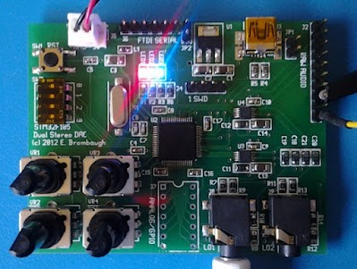

xml version="1.0" encoding="utf-8"?

STM32 4 Channel Audio

# STM32 4 Channel Audio

#### STM32 4 Channel Audio Board - fully assembled

### What is it?

This is a small (2" x 2.5") board with an STM32F105RBT6 MCU, a pair of CS4344
audio DACs and a variety of I/O resources to support development of embedded
audio synthesis applications.

### Features:

* [STM32F105RBT6](http://www.st.com/internet/com/TECHNICAL_RESOURCES/TECHNICAL_LITERATURE/DATASHEET/CD00220364.pdf)
 CPU with:
	+ 32-bit ARM Cortex-M3 CPU rated for 72MHz clock
	+ 64kB SRAM
	+ 128kB Flash
	+ 7 Timers
	+ 3 SPI (2 with I2S capability)
	+ 2 I2C
	+ 5 USART
	+ 1 USB device
	+ 2 CAN
	+ 51 GPIO pins
	+ 16 Chl to 2x 12-bit ADCs
	+ 2 12-bit DAC
	+ Note: Footprint is compatible with other 64-pin QFP parts in the
	 STM32F105/7 family for additional resources.
* Onboard 3.3V Regulator (4.75V - 15V input range)
* Filtered Analog 3.3V Supply
* 2 [CS4344](http://www.cirrus.com/en/products/cs4344-45-46-48.html) Stereo Audio DACs
* USB mini-B device connector
* Power and User LEDs
* Reset button
* 4 position DIP switch
* 4-pin SWD compatible programming interface
* 6-pin FTDI serial compatible interface
* 4 ratiometric pots on 4 analog inputs
* 14 lines MCU analog/digital I/O
* AC-coupled line-leve stereo audio on 2 3.5mm jacks
* Raw Audio + references and supplies for DC coupling

### Interfaces and Jumpers

* JP1: USB +5V supply. Install to power from USB.
* JP2: FTDI 6-pin serial +5V supply. Install to power from FTDI USB/Serial
 adapter
* J2: Raw Audio. Direct access to 4-channel DAC audio output, as well as
 supplies and mid-point references.
* J3: USB. Mini-B connector for USB device access.
* J4: STM SWD. 4-pin in-system programming connector.
* J5: Power: 4-pin keyed power connector (+5V only).
* J6: 6-pin serial connector compatible with the FTDI USB/Serial pinout.
 Use this to create devices that can talk directly to a USB host with
 minimal cabling. Could also be used for bootloaders.
* J7: 14-pin DIP footprint for access to unused GPIO on MCU.
* J8, J9: 3.5mm line-level audio outputs.
* S1: Reset button - tied directly to the MCU reset input. Handy way to
 quickly reboot your MCU after flashing new code into it.
* SW2: 4-position DIP switch directly connected to MCU GPIO.
* LED1: Power indicator - lights up when 3.3V is present.
* LED2, LED2: User GPIO - connected to GPIOB-8,9. Useful for diagnostics.
* VR1-VR4: 10K ratiometric pot inputs to 4 ADC input channels.

### Software Development

The STM32 family of parts are supported by a variety of commercial IDEs, all
of which are available in low-cost or limited free versions from the
[ST website](http://www.st.com/internet/mcu/class/1734.jsp).

I prefer to use open-source tools, so I've set up a development environment
based on the GNU C compiler for ARM, available for free from Mentor/Codesourcery.
For downloading to the target I use an STM32F4 Discovery board with stlink V2.
To ease development I also use the STM32 Standard Peripheral Library to
as a starting point for my code and then optimize out the heavyweight functions
as required. Links to all of these are here:

* [CS Lite ARM GCC](http://www.mentor.com/embedded-software/sourcery-tools/sourcery-codebench/lite-edition): be sure to get v4.5 or greater for best code.
* [STM32F4 Discovery](http://www.st.com/internet/evalboard/product/252419.jsp): for downloading and debug via SWD port.
* [STLINK tools for Linux](https://github.com/texane/stlink)
 Open-source interfaces for downloading and debugging.
* [STM32 Standard Peripheral Library](http://www.st.com/internet/com/SOFTWARE_RESOURCES/SW_COMPONENT/FIRMWARE/stm32f10x_stdperiph_lib.zip): Manufacturer's low-level C driver code.

### Design Resources

* Schematic: <stm32_usb_adac.pdf>
* Example code: <f105_dual_dac.zip>
* more to com...

### Project Status

* 2012-02-03: Started Schematic, order parts.
* 2012-02-04: Started Layout.
* 2012-02-09: Order PC boards.
* 2012-03-04: PC boards arrive. Initial checkout good.
* 2012-03-07: I2S DACs work.
* 2014-01-31: Added example code.

### Getting One

Interested? Contact me at the email below and I'll give you a link where you can
buy bare boards directly from the PCB fab. Cost for boards is about $8/ea, but with
setup and shipping expect to pay a bit more. Parts will run another $10 or so depending on
where you get them and which version of the processor you want.

[Return to Synth page.](../index.html)
##### 
**Last Updated**

:2014-01-31
##### 
**Comments to:**

[Eric Brombaugh](mailto:ebrombaugh1@cox.net)

