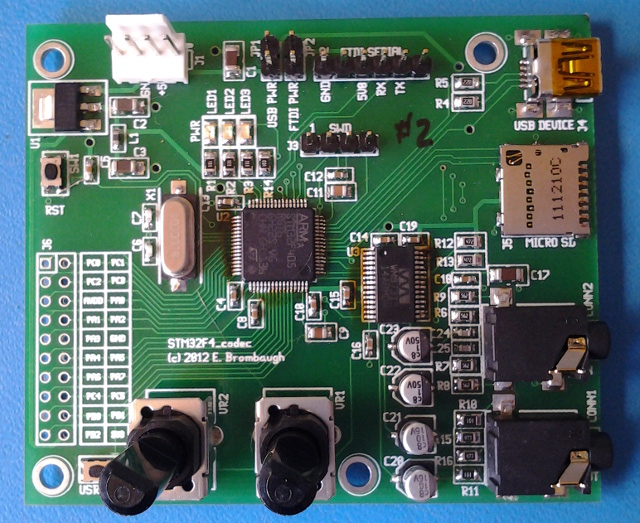
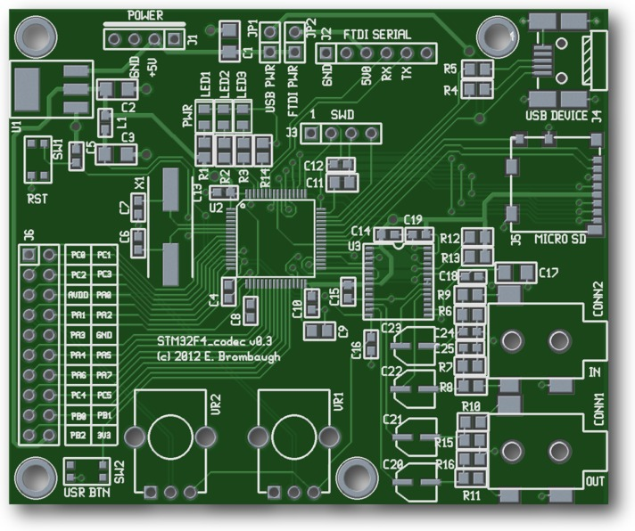

xml version="1.0" encoding="utf-8"?

STM32F4 + Codec

# STM32F4 + Codec

#### STM32F4 Codec Board - Assembled

#### STM32F4 Codec Board - PCB Rendering

### Description

This is a small (3" x 2.5") board with an STM32F405RGT6 MCU, a Wolfson WM8731
codec and a variety of I/O resources to support development of embedded
audio effects applications.

### Features:

* [STM32F405RGT6](http://www.st.com/internet/mcu/product/252144.jsp)
 CPU with:
	+ 32-bit ARM Cortex-M4 CPU with floating point and 168MHz clock
	+ 192kB SRAM
	+ 1MB Flash
	+ 14 Timers
	+ 3 SPI (2 with I2S capability)
	+ 3 I2C
	+ 6 USART+UART
	+ 2 USB device
	+ 2 CAN
	+ 51 GPIO pins
	+ 16 Chl to 3x 12-bit ADCs
	+ 2 12-bit DAC
	+ Note: Footprint is compatible with other 64-pin QFP parts in the
	 STM32F405/7 family for additional resources.
* Onboard 3.3V Regulator (4.75V - 15V input range)
* Filtered Analog 3.3V Supply
* Wolfson [WM8731](http://www.wolfsonmicro.com/products/codecs/WM8731/) Stereo Audio Codec
* USB mini-B device connector
* Micro SD slot (SPI or SDIO interface)
* Power and User LEDs
* Reset and User buttons
* 4-pin SWD compatible programming interface
* 6-pin FTDI serial compatible interface
* 2 ratiometric pots on 2 analog inputs
* 17 lines MCU analog/digital I/O
* AC-coupled line-level stereo audio I/O on 2 3.5mm jacks

### Interfaces and Jumpers

* JP1: USB +5V supply. Install to power from USB.
* JP2: FTDI 6-pin serial +5V supply. Install to power from FTDI USB/Serial
 adapter
* J1: Power: 4-pin keyed power connector (+5V only).
* J2: 6-pin serial connector compatible with the FTDI USB/Serial pinout.
 Use this to create devices that can talk directly to a USB host with
 minimal cabling. Could also be used for bootloaders.
* J3: STM SWD. 4-pin in-system programming connector.
* J4: USB. Mini-B connector for USB device access.
* J5: Micro SD slot.
* J6: 20-pin 0.1" header to unused GPIO on MCU.
* CONN1: 3.5mm stereo line-level audio output.
* CONN2: 3.5mm stereo line-level audio input.
* SW1: Reset button - tied directly to the MCU reset input. Handy way to
 quickly reboot your MCU after flashing new code into it.
* SW2: User button directly connected to MCU GPIO.
* LED1: Power indicator - lights up when 3.3V is present.
* LED2, LED2: User GPIO - connected to GPIOB-8,9. Useful for diagnostics.
* VR1,VR2: 10K ratiometric pot inputs to 2 ADC input channels.

### Software Development

The STM32 family of parts are supported by a variety of commercial IDEs, all
of which are available in low-cost or limited free versions from the
[ST website](http://www.st.com/internet/mcu/class/1734.jsp).

I prefer to use open-source tools, so I've set up a development environment
based on the GNU C compiler for ARM, available for free from Codesourcery or
the Launchpad project. For downloading to the target I use either an STM32
Discovery board with stlink V2, or the excellent Black Magic Probe. To accelerate
development I also use the STM32 Standard Peripheral Library as a starting point
for my code and then optimize out the heavyweight functions as required. Links
to all of these are here:

* [CS Lite ARM GCC](http://www.mentor.com/embedded-software/sourcery-tools/sourcery-codebench/lite-edition): be sure to get v4.5 or greater for best code.
* [STM32F4 Discovery](http://www.st.com/internet/evalboard/product/252419.jsp): for downloading and debug via SWD port.
* [STLINK tools for Linux](https://github.com/texane/stlink)
 Open-source interfaces for downloading and debugging.
* [STM32 Standard Peripheral Library](http://www.st.com/internet/com/SOFTWARE_RESOURCES/SW_COMPONENT/FIRMWARE/stm32f10x_stdperiph_lib.zip): Manufacturer's low-level C driver code.
* [Launchpad GCC](https://launchpad.net/gcc-arm-embedded)
 ARM-supported GCC (somewhat newer than the CS version above).
* [Black Magic Probe (BMP)](http://www.blacksphere.co.nz/main/blackmagic)
 A very handy JTAG/SWD download and debug probe I've been using.
* [magictpa](https://github.com/gsmcmullin/magictpa)
 Updated firmware for the BMP that makes it work even better.

### Example Source

In the Design Resources section below I've provided a zipped source directory
for a simple audio delay that demonstrates basic setup of the GPIO, ADC, I2C
and I2S peripherals. This runs the codec at 48kHz sample rate full duplex
and delays the incoming audio through a 32ksample buffer, resulting in a ~2/3
second delay. The delayed audio is mixed with the incoming audio in proportion
to the VR2 setting and sent out. Delayed audio is also mixed with incoming audio
on the input to the delay in proportion to the VR1 setting, allowing controlled
regeneration.

### Design Resources

* Schematic: <stm32f4_codec_pg1.pdf>
* BOM: <bom_sorted.xls>
* PCB Gerber files: <stm32f4_codec_gerber.zip>
* Example Source for bare GCC: <f405_i2s_delay.zip>
* Example Source for CooCox: <f405_codec_starter.zip>
* more to come...

### Project Status

* 2012-07-02: Started Schematic, order parts.
* 2012-07-07: Started Layout.
* 2012-07-10: Order PC boards.
* 2012-07-28: PCBs arrive. Routing bug in button hookup requires cut/jumper.
* 2012-08-12: Full duplex codec working.
* 2012-08-16: Posted example source and BOM, updated schematic and render. BatchPCB design corrected to V0.3
* 2012-09-30: Updated example source.
* 2012-12-11: Micro SD card slot is misrouted and won't work.
* 2013-02-24: Added CooCox example project.
* 2013-05-02: Added Gerber files (BatchPCB no longer hosting it).

### Getting One

Interested? Bare boards are no longer available from BatchPCB so you'll have to
use the raw Gerber files (above) to get them fabbed for yourself at the PCB
manufacturer of your choice.

If you build one, please let me know about it at the email below. I enjoy hearing from
others about their experiences with the design and finding out what sort of things are being
done.

[Return to Synth page.](../index.html)
##### 
**Last Updated**

:2013-05-02
##### 
**Comments to:**

[Eric Brombaugh](mailto:ebrombaugh1@cox.net)

