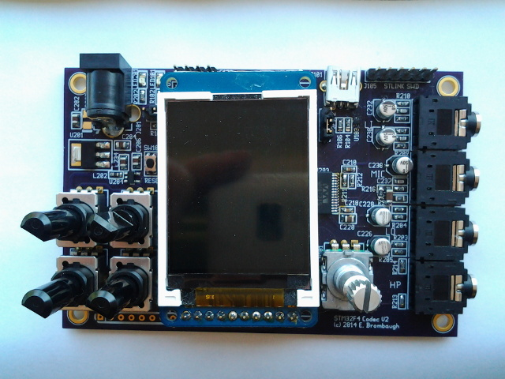
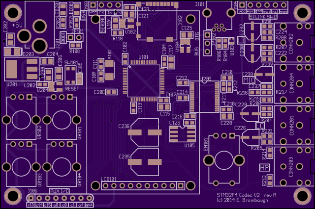

xml version="1.0" encoding="utf-8"?

STM32F4 + Codec Version 2

# STM32F4 + Codec V2

#### STM32F4 Codec V2 - Rev - Assembled

#### STM32F4 Codec V2 - Rev A PCB Rendering

### Description

This is a small (3.7" x 2.4") board with an STM32F405RGT6 MCU, a Wolfson WM8731
codec and a variety of I/O resources to support development of embedded
audio effects applications. This is a revision of the the [STM32F4 Codec](../stm32f4_codec/index.html) board.

### Features:

* [STM32F405RGT6](http://www.st.com/internet/mcu/product/252144.jsp)
 CPU with:
	+ 32-bit ARM Cortex-M4 CPU with floating point and 168MHz clock
	+ 192kB SRAM
	+ 1MB Flash
	+ 14 Timers
	+ 3 SPI (2 with I2S capability)
	+ 3 I2C
	+ 6 USART+UART
	+ 2 USB OTG
	+ 2 CAN
	+ 51 GPIO pins
	+ 16 Chl to 3x 12-bit ADCs
	+ 2 12-bit DAC
	+ Note: Footprint is compatible with other 64-pin QFP parts in the
	 STM32F405/7 family for additional resources.
* Onboard 3.3V Regulator (4.75V - 15V input range)
* Separate Analog 3.3V Supply
* Wolfson [WM8731](http://www.wolfsonmicro.com/products/codecs/WM8731/) Stereo Audio Codec
* USB mini-AB OTG connector
* Micro SD slot (SDIO interface)
* Power and User LEDs
* Reset button
* 6-pin SWD compatible programming interface
* 4-pin serial connector
* I2C serial EEPROM
* 4 ratiometric pots on 2 analog inputs
* Rotary encoder with pushbutton
* Adafruit 1.8" 128x160 color LCD
* 7 lines MCU analog/digital I/O
* AC-coupled line-level stereo audio I/O on 2 3.5mm jacks
* Headphone and microphone audio on 2 3.5mm jacks

### Interfaces and Jumpers

* JP101: STM32 Boot mode jumper. Install to run bootloader.
* JP102: USB VBUS selector. Choose bus power, self power or OTG.
* J201: Power: 4-pin keyed power connector (+5V only).
* J101: USB. Mini-AB connector for USB device/host.
* J102: Micro SD slot.
* J103: 4-pin serial connector.
* J105: ST-Link SWD. 6-pin in-system programming connector.
* J106: 8-pin 0.1" header to unused GPIO on MCU.
* CONN201: 3.5mm stereo line-level audio output.
* CONN202: 3.5mm stereo line-level audio input.
* CONN203: 3.5mm microphone input.
* CONN204: 3.5mm headphone output.
* SW101: Reset button - tied directly to the MCU reset input. Handy way to
 quickly reboot your MCU after flashing new code into it.
* LED201: Power indicator - lights up when 3.3V is present.
* LED101: User GPIO - connected to GPIOB-8,9. Useful for diagnostics.
* VR101,VR102, VR103, VR104: 10K ratiometric pot inputs to 2 ADC input channels.

### Software Development

For development I use a basic make / gcc flow with my favorite text editor which runs
well in either Linux, Mac OS X or Windows. For downloading to hardware and debugging
the ST Discovery boards with STLINK V2 are well supported under Open OCD. Here's
a list of where to get the tools:

* [Launchpad GCC](https://launchpad.net/gcc-arm-embedded)
 ARM-supported GCC.
* [STM32F4 Discovery](http://www.st.com/internet/evalboard/product/252419.jsp): for downloading and debug via SWD port.
* [Open OCD](http://openocd.sourceforge.net/)
 Open-source interface for downloading and debugging via ST-Link.
* [STM32F34xx DSP and Standard Peripheral Libraries](http://www.st.com/web/catalog/tools/FM147/CL1794/SC961/SS1743/LN1734/PF257901): Manufacturer's low-level C driver code.

### Design Resources

* Schematic: <stm32f4_codec_v2_schematic.pdf>
* BOM: <bom.xls>
* Gerbers (OSHpark naming): <stm32f4_codec.oshpark.zip>
* Board @ OSHpark: [stm32f4\_codec v2 rev A](https://oshpark.com/shared_projects/E6pZAmyS)
* Demo software: <f4_codec_v2_demo.zip>
* more to come...

### Project Status

* 2012-12-29: Started Revised Layout.
* 2014-05-08: Major schematic revisions.
* 2014-05-16: Order PC boards.
* 2014-05-30: PC boards received from fab.
* 2014-06-07: Assembled, testing features.
+ Codec Line in/out, LCD, ADC, Serial, Encoder works.
+ New headphone driver works.
+ Mic input requires minor wiring fix but works.
+ Power Jack footprint needs corrections, but usable.
+ USB DFU Bootloader not enumerating.

* 2014-06-10: USB MIDI device works.
* 2014-06-27: SDIO works.
* 2014-06-30: USB MIDI host works.
* 2014-07-01: EEPROM works.
* 2014-07-02: Fix Xtal caps - USB DFU Bootloader works.
* 2014-07-03: Update schematic, layout, order Rev A boards.
* 2014-07-18: Rev A boards back from fab. Tested and all features working.
* 2017-08-04: Board shared at OSHpark.

[Return to Synth page.](../index.html)
##### 
**Last Updated**

:2017-08-04
##### 
**Comments to:**

[Eric Brombaugh](mailto:ebrombaugh1@cox.net)

