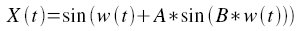
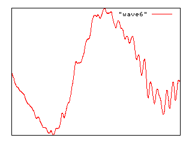
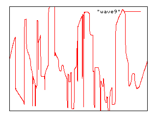

xml version="1.0" encoding="utf-8"?

Modcan VCDO 58A/B

# Modcan VCDO 58A/B

## Introduction

The [Modcan VCDO 58A/B](http://www.modcan.com/bseries/VCDO.html) is a voltage-controlled digital oscillator for use in analog sound synthesis. Introduced in September 2006, it features a combination of synthesis techniques not found in previous analog synthesis modules and consequently has caused some curiosity about how it works. This document will cover some of the high-level architectural details of this unique device to promote a better understanding of its capabilities and applications. 

## Hardware

The heart of the VCDO hardware is a DSP microcontroller. This part integrates the processor, memory and peripherals required to sample the control voltages and compute the waveforms. Control voltages are buffered, scaled and summed with the front panel knob settings in the control voltage signal conditioning section. The DAC and output amplifier convert the digital waveform to an audio frequency voltage.

## Theory of Operation

The VCDO signal processing consists of the following stages:
* ### Oscillator.

The 1V/Octave CV is offset by the Range knob and quantized with hysteresis to an equally tempered semitone scale. Hysteresis provides a sharp boundary in the quantizer and prevents noise at the transition. The Quantize switch selects either the quantized or unquantized value and the result is summed with The Expo FM CV,offset by the Fine tuning knob.
 
The sum of the various frequency controls is is still in exponential (V/Oct) form, so it must be converted to linear (V/Hz) form. Two operating ranges are supported, selectable by the High/Low front panel range switch. Low range is use for LFO operation and runs from 0.04Hz to 40Hz, while High range is best suited for audio frequencies and runs from 10Hz to 10KHz.

The linear frequency control drives a Numerically Controlled Oscillator (NCO) which generates a phase word used in subsequent processing stages. Rising edges of the Sync input will reset the NCO phase to 0, allowing the resulting waveform phase to be controlled.
* ### Frequency Modulation

The VCDO supports [Frequency Modulation Synthesis](http://en.wikipedia.org/wiki/Frequency_modulation_synthesis) as defined by Chowning. I call the simplified version provided by the VCDO "Two-operator Phase-Locked FM/PM" since it borrows heavily from the technique found in some classic FM synthesizers.

FM synthesis is defined by the equation:

where A is called the 'Modulation Index' and B is called the 'Modulation to Carrier Ratio', or simply 'Modulation Ratio'. These two quantities control the harmonic content of the resulting sound. The quantity w(t) is the carrier frequency and represents the fundamental pitch of the oscillator.

In the VCDO's implementation, the Ratio CV is offset by the FM Ratio knob setting and quantized with hysteresis to 32 distinct modulation ratios. These ratios are in the range

[0, 0.25, 0.5, 0.75, 1.0, 1.25, ... 7.75]

Because these ratios are exact multiplies of 0.25, the modulation frequency will always be some multiple of 1/4 the carrier frequency and can be considered to be phase-locked to the carrier frequency. This prevents undesired variations in timber and provides a broad range of harmonic possibilies, with subharmonics of the main oscillator note sounding two octaves below it.

The Index CV is offset by the FM Index knob setting and scaled to create a modulation index in the range of 0 to 314%. This provides a smooth variation from the waveshape as defined by the wave table (see below) to one with increasing harmonic complexity.
* ### Quadrature Processing

The output of the FM processor is a phase value. This phase value is split into two, one of which has a 90 degree offset providing a quadrature phase. After the Wave Table, the resulting waveforms can be used for image reject modulation, 3D spatialization, or complex LFO applications.
* ### Wave Table

The Wave Sel CV is summed with the Wave front panel knob and quantized to 16 levels with hysteresis to prevent noise at the transition points. This 4-bit binary value is displayed on the front-panel LEDs and selects the waveform. Note that there is no interpolation between the waveforms - slewing the Wave Sel CV results in distinct stepping between the different wave shapes, not a smooth transition from one to the next.

The VCDO provides 16 different wave shapes, generally ordered by increasing harmonic content:

	+ #### Sine
	
	
	This uses the same sine calculation found in the FM computations and provides the purest sounding tone of all those available in the VCDO.
	+ #### Triangle
	
	
	This is a computed waveform that generates the classic triangle waveshape.
	+ #### Wave 1 - 10
	
	
	These are arbitrary waveforms stored in the DSP. They are pre-defined and cannot be altered by the end user.
	
	
	
	
	
	+ #### Saw
	
	
	This is a computed waveform that generates the classic sawtooth waveshape.
	+ #### PWM/Square
	
	
	This is a computed pulse waveform with the pulse width defined by the PWM/AM CV and front-panel knob. Because the PWM/AM CV controls pulse width for this waveform, the AM function is fixed at its maximum positive value.
	+ #### PWM/Double Pulse
	
	
	This is a computed pulse waveform consisting of a positive and negative pulse, symmetrically spaced. The pulse width is defined by the PWM/AM CV and front-panel knob. Because the PWM/AM CV controls pulse width for this waveform, the AM function is fixed at its maximum positive value.
	+ #### Noise
	
	
	This is a pseudo-random noise waveform clocked at the NCO frequency. It has several unique characteristics: When the FM Ratio is set to 0, it generates a stepped random voltage. Other settings of FM Ratio generate a linear-interpolation between the random voltages which can be distorted with the FM Ratio and Index CVs, resulting in interesting timber variations.
* ### Amplitude Modulation

For waveforms that don't require PWM control, the PWM/AM CV drives a final gain control stage. This is a fully balanced modulator with +/-100% range, allowing true DSSC AM (ring mod) effects. Combined with an external envelope generator this feature also can function as a linear VCA.

## Firmware Implementation

Although it is beyond the scope of this description to dig deeply into the firmware design, the VCDO shares many architectural details with my earlier [Digital VCO](../dvco.html) project. The VCDO uses a much more sophisticated processor, higher sample rates, wider data words and overall higher quality analog signal processing.

 
[Return to Synth page.](../index.html)
##### 
**Last Updated**

:2008-05-25
##### 
**Comments to:**

[Eric Brombaugh](mailto:ebrombaugh1@cox.net)

