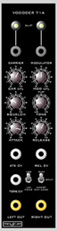
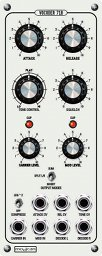

xml version="1.0" encoding="utf-8"?

Vocoder

# Vocoder

## Function

The Modcan Vocoder 71 A/B is a 10-channel 4th-order vocoder with voltage control of envelope attack, decay and
tone control. It provides switchable linear or logarithmic envelope gain response, as well as user-controlled squelch.
Three output modes are available:

* Normal - vocoded output on Left output, gated modulation output on Right output
* Split - even channels on Left output, odd channels on Right output
* Invert - High modulation channels mapped to low carrier channels and vice versa

## Samples

[vocoder\_test.mp3](./vocoder_test.mp3)
## Links

* [Modcan site](http://www.modcan.com/modhtml/vocoder_a.html)

[Return to Synth page.](index.html)
##### 
**Last Updated**

:2010-12-19
##### 
**Comments to:**

[Eric Brombaugh](mailto:ebrombaugh1@cox.net)

